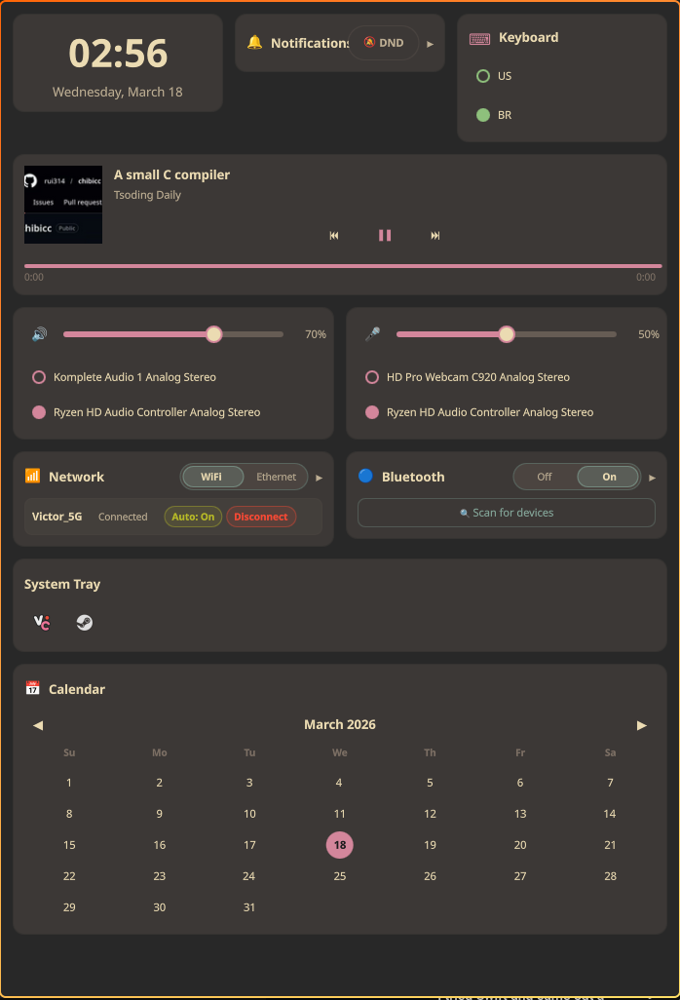

# QuickDash

This is my personal Wayland dashboard, built with [QuickShell](https://quickshell.outfoxxed.me/). It lives as a toggleable overlay — out of the way when I don't need it, instantly available when I do. No persistent bars, no always-on widgets eating screen space.

<p align="center">
  
  
</p>

If you're looking for ideas or a starting point for your own setup, feel free to borrow whatever's useful here. If you feel like discussing ideas, open up an issue.

> **Disclaimer:** Major parts of this repository were written by AI (as you can see by the poor code quality and the emote overflow below).

## What it does

- 🕐 **Clock** — time, date, and an integrated focus timer
- 🗂 **Capture Pad** — merged scratchpad + clipboard history with quick recopy
- 🎵 **Now Playing** — media controls with album art via MPRIS
- 🔊 **Audio** — volume, mute, output switching
- ☀ **Brightness** — screen brightness + Night Light toggle (hides itself if there's no backlight)
- 📶 **Network** — WiFi/Ethernet status, scan, connect/disconnect, forget networks
- 🔵 **Bluetooth** — paired devices, power toggle, connect/disconnect
- 🔔 **Notifications** — built-in notification daemon with history and DND
- ⌨ **Keyboard** — layout switcher (Hyprland only)
- 📅 **Calendar** — month grid
- 🔋 **Battery** — percentage, state, time remaining (hides on desktop)
- 🚀 **Quick Launcher** — configurable app and command launcher
- ▫ **System Tray** — StatusNotifierItem icons

## Requirements

- **QuickShell** ≥ v0.2.1
- **PipeWire**, **NetworkManager**, **BlueZ** — the usual system services

Optional but worth having:
- **Hyprland** — needed for the keyboard layout switcher; also what I use as my compositor
- **brightnessctl** — needed to change brightness from the brightness widget
- **hyprsunset** — needed for the Night Light toggle in the brightness widget
- **cliphist** — needed for clipboard history inside Capture Pad
- **gtk-launch** — needed if you want launcher entries that use desktop ids

## Running it

Clone it somewhere (I keep mine at `~/.config/quickdash`):

```bash
git clone <your-fork-url> ~/.config/quickdash
quickshell -p ~/.config/quickdash
```

### My Hyprland setup

I run QuickDash inside a Hyprland special workspace alongside a terminal, so I can summon both with a single keybind:

```ini
# Super + ` toggles the dashboard workspace
bind = SUPER, GRAVE, togglespecialworkspace, dash

# Auto-launch QuickDash + a terminal the first time the workspace opens
workspace = special:dash, on-created-empty: quickshell -p ~/.config/quickdash & kitty
```

Reload Hyprland and `Super + \`` will toggle the whole thing.

## Configuration

Copy the example config and edit it:

```bash
cp ~/.config/quickdash/config.example.json ~/.config/quickdash/config.json
```

The main options:

```json
{
    "colorScheme": "catppuccin-mocha",
    "audioQuickSwitch": ["Speakers", "Headphones"],
    "quickCommands": [
        { "label": "Terminal", "icon": "", "command": ["kitty"] },
        { "label": "Browser", "icon": "🌐", "desktop": "firefox" },
        { "label": "Reload Waybar", "icon": "↻", "shell": "pkill -USR2 waybar", "closeOnLaunch": false }
    ],
    "keyboardLayouts": ["us", "br"],
    "topAnchor": ["clock"],
    "bottomAnchor": ["systemTray", "calendar"],
    "middleDefault": ["notificationCenter", "batteryStatus"],
    "sidebar": [
        { "widget": "capturePad", "icon": "🗂" },
        { "widget": "quickCommands", "icon": "🚀" },
        { "widget": "networkPanel",    "icon": "📶" },
        { "widget": "bluetoothPanel",  "icon": "🔵" },
        { "widget": "audioControl",    "icon": "🔊" },
        { "widget": "audioInputControl", "icon": "🎤" },
        { "widget": "brightnessControl", "icon": "☀" },
        { "widget": "displayControl",  "icon": "🖥" },
        { "widget": "keyboardLayout",  "icon": "⌨" }
    ]
}
```

You can also set `windowWidth` and `windowHeight` to override the default 420×900 size.

QuickDash now hides unsupported widgets automatically. If the machine has no battery, no Bluetooth controller, no usable backlight control, or no second monitor, those widgets disappear from the layout and the sidebar instead of showing dead UI.

### Audio quick switch

`audioQuickSwitch` does two things: the ⇄ button cycles through those devices in order, and the sink list only shows devices whose name contains one of those strings. Leave it empty to show everything.

To find your sink names:

```bash
pactl list sinks | grep "Description:"
```

### Quick launcher

Launcher entries live under `quickCommands`.

- Use `command` with an array for direct process execution.
- Use `shell` when you explicitly want a shell snippet.
- Use `desktop` for a desktop id launched with `gtk-launch`.
- Optional per-entry fields: `closeOnLaunch`, `workingDirectory`, `environment`, `clearEnvironment`.

Example:

```json
{
    "quickCommands": [
        {
            "label": "Terminal",
            "icon": "",
            "command": ["kitty"]
        },
        {
            "label": "Projects",
            "icon": "🧰",
            "command": ["code", "."],
            "workingDirectory": "/home/victor/projects"
        },
        {
            "label": "Browser",
            "icon": "🌐",
            "desktop": "firefox"
        },
        {
            "label": "Reload Waybar",
            "icon": "↻",
            "shell": "pkill -USR2 waybar",
            "closeOnLaunch": false
        }
    ]
}
```

### Layout Zones

QuickDash uses a 3-zone anchored layout plus a sidebar. The zones are configured via arrays in your config file.

- `topAnchor`: Widgets shown at the top of the dashboard. Usually just `clock`.
- `bottomAnchor`: Widgets shown at the bottom of the dashboard. Usually `systemTray` and `calendar`.
- `middleDefault`: Widgets shown in the center space when no sidebar panel is open. Commonly `notificationCenter`.
- `sidebar`: List of objects specifying the widgets that open as panels when clicked, along with their icon.

Available widget names:

| Name | Widget |
|------|--------|
| `capturePad` | Notes + clipboard history |
| `clock` | Clock |
| `nowPlaying` | Media player (Auto-appears via MiniPlayer when active) |
| `quickCommands` | Quick launcher |
| `audioControl` | Volume (output) |
| `audioInputControl` | Volume (input/mic) |
| `brightnessControl` | Brightness |
| `displayControl` | Display mirror mode toggle |
| `networkPanel` | Network |
| `bluetoothPanel` | Bluetooth |
| `notificationCenter` | Notifications |
| `keyboardLayout` | Keyboard layout |
| `calendar` | Calendar |
| `batteryStatus` | Battery |
| `configPanel` | Theme picker |
| `systemMonitor` | CPU, memory, and thermal stats |
| `powerMenu` | Power actions |
| `systemTray` | System tray |

## Color schemes

- `catppuccin-mocha` — dark, lavender accents
- `catppuccin-macchiato` — dark
- `catppuccin-frappe` — dark
- `catppuccin-latte` — light
- `nord` — blue-gray
- `dracula` — dark purple
- `gruvbox` — warm retro (what I use)
- `tokyo-night` — dark blue/purple
- `rose-pine` — dark pine/rose
- `solarized-dark` — teal/blue
- `everforest` — warm green

## Project structure

```
quickdash/
├── shell.qml              # Entry point
├── Dashboard.qml          # Dashboard window content
├── NotificationToastWindow.qml  # Toast overlay
├── config.example.json    # Example config for new users
├── .github/               # Screenshots and assets
├── theme/                 # Styling and palettes
│   ├── Theme.qml
│   ├── Palettes.qml
│   └── qmldir
├── services/              # Logic and system interactions
│   ├── AudioService.qml
│   ├── ClipboardService.qml
│   ├── NetworkService.qml
│   ├── BluetoothService.qml
│   ├── DisplayService.qml
│   ├── FeatureSupport.qml
│   ├── SystemState.qml
│   ├── ProcUtils.qml
│   └── qmldir
├── components/            # Reusable UI parts
│   ├── Card.qml
│   ├── DeviceRow.qml
│   ├── TogglePill.qml
│   ├── StyledSlider.qml
│   ├── SidebarIcon.qml
│   ├── PanelHeader.qml
│   └── qmldir
└── widgets/               # Functional dashboard modules
    ├── CapturePad.qml
    ├── Clock.qml
    ├── MiniPlayer.qml
    ├── NowPlaying.qml
    ├── QuickCommands.qml
    ├── AudioControl.qml
    ├── BrightnessControl.qml
    ├── DisplayControl.qml
    ├── NetworkPanel.qml
    ├── BluetoothPanel.qml
    ├── NotificationCenter.qml
    ├── KeyboardLayout.qml
    └── qmldir
```

QuickShell supports live reloading — edit any `.qml` file and changes apply instantly.

## Troubleshooting

**Notifications not showing** — QuickDash runs its own notification daemon, so only one can be active at a time. Kill any other daemons first:

```bash
killall dunst mako swaync fnott 2>/dev/null
```

Then test with `notify-send "Test" "Hello"`.

**Now Playing not working** — the widget needs an MPRIS-compatible player. Check with:

```bash
playerctl -l
playerctl metadata
```

If nothing shows up, restart your browser or player.
