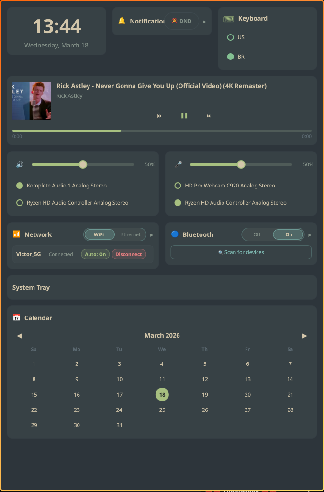

# QuickDash

This is my personal Wayland dashboard, built with [QuickShell](https://quickshell.outfoxxed.me/). It lives as a toggleable overlay — out of the way when I don't need it, instantly available when I do. No persistent bars, no always-on widgets eating screen space.

<p align="center">
  
  
</p>

If you're looking for ideas or a starting point for your own setup, feel free to borrow whatever's useful here. If you feel like discussing ideas, open up an issue.

> **Disclaimer:** Major parts of this repository were written by AI (as you can see by the poor code quality and the emote overflow below).

## What it does

- 🕐 **Clock** — time & date
- 🎵 **Now Playing** — media controls with album art via MPRIS
- 🔊 **Audio** — volume, mute, output switching
- ☀ **Brightness** — screen brightness + Night Light toggle (hides itself if there's no backlight)
- 📶 **Network** — WiFi/Ethernet status, scan, connect/disconnect, forget networks
- 🔵 **Bluetooth** — paired devices, power toggle, connect/disconnect
- 🔔 **Notifications** — built-in notification daemon with history and DND
- ⌨ **Keyboard** — layout switcher (Hyprland only)
- 📅 **Calendar** — month grid
- 🔋 **Battery** — percentage, state, time remaining (hides on desktop)
- ▫ **System Tray** — StatusNotifierItem icons

## Requirements

- **QuickShell** ≥ v0.2.1
- **PipeWire**, **NetworkManager**, **BlueZ** — the usual system services

Optional but worth having:
- **Hyprland** — needed for the keyboard layout switcher; also what I use as my compositor
- **hyprsunset** — needed for the Night Light toggle in the brightness widget

## Running it

Clone it somewhere (I keep mine at `~/.config/quickdash`):

```bash
git clone <your-fork-url> ~/.config/quickdash
quickshell -p ~/.config/quickdash
```

### My Hyprland setup

I run QuickDash inside a Hyprland special workspace alongside a terminal, so I can summon both with a single keybind:

```ini
# Super + ` toggles the dashboard workspace
bind = SUPER, GRAVE, togglespecialworkspace, dash

# Auto-launch QuickDash + a terminal the first time the workspace opens
workspace = special:dash, on-created-empty: quickshell -p ~/.config/quickdash & kitty
```

Reload Hyprland and `Super + \`` will toggle the whole thing.

## Configuration

Copy the example config and edit it:

```bash
cp ~/.config/quickdash/config.example.json ~/.config/quickdash/config.json
```

The main options:

```json
{
    "colorScheme": "catppuccin-mocha",
    "audioQuickSwitch": ["Speakers", "Headphones"],
    "keyboardLayouts": ["us", "br"],
    "layout": [ ... ]
}
```

You can also set `windowWidth` and `windowHeight` to override the default 480×900 size.

### Audio quick switch

`audioQuickSwitch` does two things: the ⇄ button cycles through those devices in order, and the sink list only shows devices whose name contains one of those strings. Leave it empty to show everything.

To find your sink names:

```bash
pactl list sinks | grep "Description:"
```

### Layout

Widgets are arranged as an array of rows. Each row is an array of widget names — widgets in the same row share the width equally.

Available widget names:

| Name | Widget |
|------|--------|
| `clock` | Clock |
| `nowPlaying` | Media player |
| `audioControl` | Volume (output) |
| `audioInputControl` | Volume (input/mic) |
| `brightnessControl` | Brightness |
| `networkPanel` | Network |
| `bluetoothPanel` | Bluetooth |
| `notificationCenter` | Notifications |
| `keyboardLayout` | Keyboard layout |
| `calendar` | Calendar |
| `batteryStatus` | Battery |
| `systemTray` | System tray |

Default layout if you omit it:

```json
"layout": [
    ["clock"],
    ["notificationCenter", "keyboardLayout"],
    ["nowPlaying"],
    ["audioControl", "audioInputControl"],
    ["networkPanel"],
    ["bluetoothPanel"],
    ["calendar"],
    ["batteryStatus"],
    ["systemTray"]
]
```

## Color schemes

- `catppuccin-mocha` — dark, lavender accents
- `catppuccin-latte` — light
- `nord` — blue-gray
- `dracula` — dark purple
- `gruvbox` — warm retro (what I use)

## Project structure

```
quickdash/
├── shell.qml
├── Dashboard.qml
├── config.example.json
├── theme/
│   ├── Theme.qml
│   ├── Palettes.qml
│   └── qmldir
├── services/
│   ├── AudioService.qml
│   ├── NetworkService.qml
│   ├── BluetoothService.qml
│   ├── SystemState.qml
│   └── qmldir
├── components/
│   ├── Card.qml
│   ├── DeviceRow.qml
│   ├── TogglePill.qml
│   ├── StyledSlider.qml
│   └── ...
└── widgets/
    ├── Clock.qml
    ├── NowPlaying.qml
    ├── AudioControl.qml
    └── ...
```

QuickShell supports live reloading — edit any `.qml` file and changes apply instantly.

## Troubleshooting

**Notifications not showing** — QuickDash runs its own notification daemon, so only one can be active at a time. Kill any other daemons first:

```bash
killall dunst mako swaync fnott 2>/dev/null
```

Then test with `notify-send "Test" "Hello"`.

**Now Playing not working** — the widget needs an MPRIS-compatible player. Check with:

```bash
playerctl -l
playerctl metadata
```

If nothing shows up, restart your browser or player.
